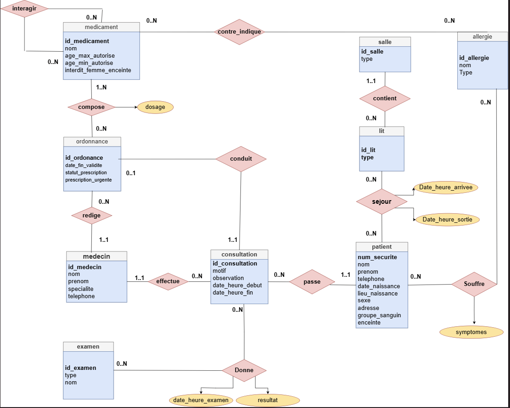

# Système de gestion hospitalière

Projet universitaire de base de données réalisé autour de la gestion d’un système hospitalier.

Le projet permet de gérer les patients, médecins, consultations, séjours, ordonnances, examens et médicaments à travers une base de données relationnelle.
## Modélisation de la base de données

## Fonctionnalités

- Gestion des patients
- Gestion des médecins
- Gestion des consultations
- Gestion des séjours hospitaliers
- Gestion des ordonnances et médicaments
- Gestion des examens médicaux
- Triggers SQL
- Vues et gestion des droits
- Chargement automatisé des données avec SQL*Loader

## Technologies utilisées

- SQL
- Oracle Database
- SQL*Loader
- Shell Script

## Structure du projet

- `sql/` : scripts SQL principaux
- `loader/` : fichiers `.ctl` pour le chargement des données
- `scripts/` : automatisation du chargement
- `docs/` : documentation éventuelle

## Fichiers principaux

- `projet.sql` : création de la base de données
- `triggers.sql` : gestion des triggers
- `vuesetdroits.sql` : vues et permissions
- `charger_tout.sh` : chargement automatisé

## Auteur

Yasmine LABCHRI
